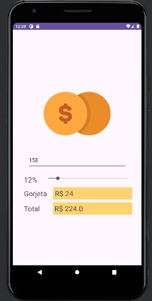

# Calculadora de Gorjetas Android



Uma aplicação Android simples que ajuda a calcular a gorjeta em restaurantes, bares ou outros lugares onde deixar uma gorjeta é comum.

## Funcionalidades

- Calcule a gorjeta com base no valor da conta e a porcentagem desejada.
- Divida a conta entre várias pessoas.
- Interface amigável desenvolvida em Java com o Android Studio.

## Tecnologias Utilizadas

- Java
- Android Studio

## Como Utilizar

1. Faça o download ou clone este repositório:

   ```bash
   git clone https://github.com/daanimatrix/Calculadora-de-Gorjeta-java-android.git

Abra o projeto no Android Studio.

Execute a aplicação em um emulador Android ou dispositivo físico.

Preencha o valor da conta, a porcentagem de gorjeta desejada e o número de pessoas.

Toque no botão "Calcular Gorjeta" para obter o resultado.

Contribuições
Contribuições são bem-vindas! Sinta-se à vontade para abrir problemas (issues) e enviar pull requests.

Licença
Este projeto é licenciado sob a Licença MIT.
